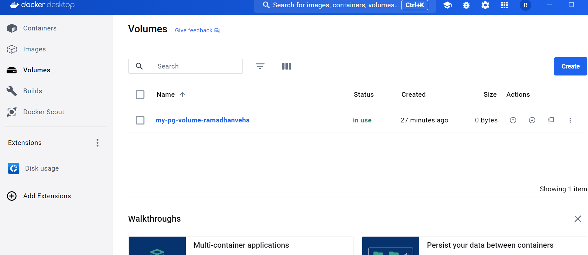

docker run -d --name my-postgres-ramadhanveha -e POSTGRES_USER=postgres -e POSTGRES_PASSWORD=password -v my-pg-volume-ramadhanveha:/var/lib/postgresql/data -p 5431:5432 postgres

volume :

container :

koneksi ke server baru :

membuat table baru :

membuat yang baru :
docker run -d --name my-postgres-v2-ramadhanveha -e POSTGRES_USER=postgres -e POSTGRES_PASSWORD=password -v my-pg-volume-ramadhanveha:/var/lib/postgresql/data -p 5431:5432 postgres

volume masih sama :

container :

table masih ada :

